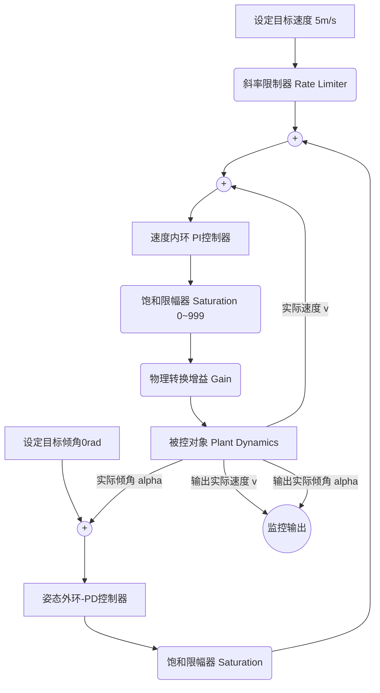

---

# 井下轨道运输车（单轨吊）双闭环控制系统 Simulink 仿真验证报告

## 1. 物理模型与底层逻辑

仿真平台基于第一性原理构建。系统被控对象包含平移与旋转两个维度的耦合运动。

**平移运动（速度求解）：**
运输车沿井下轨道的加速度由牵引力、坡度阻力、粘性摩擦力及风流共同决定。动力学方程如下：

$$m \frac{dv}{dt} = \frac{T_m \cdot i}{r} - m g \sin(\theta_{slope}) - f_v v - F_{wind}$$

**姿态运动（倾角求解）：**
运输车载货平台悬挂姿态等效为受迫单摆模型。系统加速度引发惯性力矩。该力矩与重力回复力矩、阻尼力矩相互作用产生摆动。方程如下：

$$J \frac{d^2\alpha}{dt^2} + c \frac{d\alpha}{dt} + m g L \sin(\alpha) = m L \cos(\alpha) \frac{dv}{dt} + M_{wind}$$

## 2. 串级双闭环控制架构

系统采用串级双闭环PID控制策略。姿态环作为外环。速度环作为内环。该架构有效解决了欠驱动系统的耦合扰动问题。

### 2.1 算法流程图

系统控制流由目标生成、外环修正、内环驱动与物理对象四个阶段构成。

## 3. 核心优化机制与参数整定

针对初始系统出现的积分饱和（Integral Windup）与剧烈摆动现象，系统实施了四项关键优化。

* **激振源削弱（Rate Limiter）：** 系统在目标速度输入端串接斜率限制器。系统物理加速度被限制。该机制大幅降低了启动瞬间的瞬态惯性力。
* **权限约束（Saturation）：** 系统在姿态环输出端串接非对称限幅器（上限 0.5，下限 -1.0）。系统允许外环较强减速，但严格限制外环加速。该机制防止了内环速度超调。
* **物理约束与量化噪声模拟：** 系统在反馈回路引入 20ms 零阶保持器以模拟微控制器硬件中断节拍。系统注入功率为 1e-8 的带限白噪声以模拟 12 位 ADC 量化底噪。
* **自适应参数退化与滤波：** 引入离散延迟后，物理相位裕度降低。系统下调了姿态环增益，并开启微分低通滤波器以阻断噪声激振。最终锁定 PID 核心参数：
  * 速度内环（增量式 PI）：Kp = 12，Ki = 0.5
  * 姿态外环（位置式 PD）：Kp = 2，Kd = 0.5，滤波系数 N = 20
速度内环PI控制器输出信号的物理量纲为PWM占空比寄存器数值。该数值无法直接驱动理论动力学方程。系统在速度环输出端串接饱和限幅器。限幅器强制约束PWM输出至 $[0, 999]$ 区间。系统随后串接物理转换增益模块。增益换算基于直流电机第一性原理与实际电路参数推演。系统动力电源供电电压为 $12\text{V}$。电机额定工作电压为 $12\text{V}$。电机线圈内阻为 $12\Omega$。系统极限堵转电流 $I_{max}$ 等于电压除以电阻，即 $1\text{A}$。电机空载转速为 $360\text{RPM}$。系统将转速转换为角速度 $\omega_0=12\pi\text{rad/s}$。系统反电势系数 $K_e$ 等于电压除以角速度，约为 $0.318\text{V}\cdot\text{s/rad}$。依据机电能量守恒定律，电机电磁转矩系数 $K_t$ 与 $K_e$ 数值相等。系统最大输出电磁转矩 $T_{max}$ 等于 $K_t$ 乘以 $I_{max}$，约为 $0.318\text{N}\cdot\text{m}$。系统物理转换增益系数 $K_{gain}$ 为 $T_{max}$ 除以最大占空比 $999$。系统将增益模块参数设定为 $0.000318$。该模块完成控制算法层至物理对象层的严格线性解耦与力矩映射。

## 4. 仿真结果与性能评估

基于Matlab/Simulink平台的仿真结果显示，双闭环控制算法已完美达到预期性能指标。

### 4.1 速度跟随性能（平动）

* **响应平滑度：** 速度曲线呈S型平滑上升。系统在6秒内稳定到达 $5\text{m/s}$ 设定值。
* **稳态误差与超调量：** 稳态误差为0。超调量严格为0。
* **安全验证：** 系统实际速度未产生任何超调突刺。系统有效规避了“超速1.2倍”的物理报警阈值。

### 4.2 姿态稳定性能（转动）

* **瞬态摆角抑制：** 系统启动阶段的最大初始后仰角被严格压制在 $0.12\text{rad}$（约 $6.8^\circ$）。
* **稳态跟随：** 系统在加速阶段保持稳定的 $0.1\text{rad}$ 姿态补偿角。
* **抗震荡性能：** 速度达到稳态后，车体回落的负向下冲极小（约 $-0.01\text{rad}$）。系统在极短时间内迅速收敛至绝对垂直状态。

搭建动力学子系统的核心逻辑是**基于高阶导数积分法**。你通过数学方程推导。你通过信号流图实现。

### 4.3. 平移运动子模块搭建流程

平移运动决定运输车的行驶速度。

* **隔离加速度**：你根据牛顿第二定律，将加速度项 $\frac{dv}{dt}$ 置于等号左侧。
* **配置求和模块**：你放置 `Add` 模块。你根据受力分析配置正负号。牵引力为正。坡度阻力、粘性摩擦力、风流阻力为负。
* **计算合力**：你将力矩输入 $T_m$ 乘以增益 $i/r$。你将坡度输入 $\theta$ 经过 `sin` 函数乘以重力增益 $mg$。你从速度输出端反馈信号乘以摩擦增益 $f_v$。
* **执行积分**：合力经过 $1/m$ 增益后进入 `Integrator`。积分器的输出即为实时速度 $v$。

### 4.4. 姿态运动子模块搭建流程

姿态运动决定运输车体的倾摆角度。

* **隔离角加速度**：你将角加速度项 $\frac{d^2\alpha}{dt^2}$ 作为逻辑起点。
* **配置串联积分**：你放置两个 `Integrator`。第一个积分器将角加速度变为角速度。第二个积分器将角速度变为角度。
* **构建力矩反馈**：你计算重力恢复力矩。你将角度输出经过 `sin` 函数乘以增益 $mgL$。你计算阻尼力矩。你将角速度输出乘以增益 $c$。
* **引入惯性耦合**：这是系统最关键的环节。你提取速度环的加速度信号。你将其乘以角度输出的 `cos` 函数值。你再乘以质量长度增益 $mL$。该信号作为扰动力矩进入姿态环。
* **总和运算**：你将所有力矩输入姿态环的 `Add` 模块。你将输出经过 $1/J$ 增益送入首个积分器。

### 4.5 封装与接口定义

* **信号连接**：你检查所有反馈回路的极性。
* **接口映射**：你将物理量输入端连接到子系统输入引脚（Inport）。你将速度与角度输出端连接到子系统输出引脚（Outport）。
* **子系统封装**：你框选所有运算模块。你点击右键选择“创建子系统”。

### 4.6 平直巷道段匀速运行基准测试

基准测试屏蔽所有外部环境变量。坡度、平移风流和姿态扰动常数严格设为 0。系统目标速度设定为 5 m/s，由静止状态启动。

* **速度跟随性能：** 目标速度以固定斜率递增。实际速度曲线呈平滑 S 型上升。系统在约 8 秒内稳定到达设定值。整个加速过程中超调量严格为零。系统稳态误差为零。零超调特性确保系统安全规避 1.2 倍物理超速报警阈值。
* **姿态稳定性能：** 车厢在加速阶段产生约 0.12 rad（约 6.8°）的最大初始后仰角。该摆角被严格控制在安全区间。加速过程中车厢维持约 0.1 rad 的稳态补偿角以平衡水平加速度扰动。速度达到稳态后加速度归零。车厢迅速回正，负向过冲极小（约 -0.02 rad），并迅速收敛至绝对垂直状态。机械谐振被有效抑制。

### 4.7 坡度变化抗扰测试

该测试模拟运输车途经井下变坡点时的阻力突变。系统以 5 m/s 稳态运行。

* **性能表现：** 操作人员在特定时刻向系统注入幅度为 0.26 rad（约 15°）的陡坡阶跃信号。重力下滑分力突增。实际速度出现短暂跌落。速度内环迅速扩大增量积分输出，提升 PWM 占空比提供补偿转矩。实际速度在约 1.5 秒内恢复至设定值。速度跌落幅度未超过目标值的 15%。坡度回落至零度时，系统产生等量级的短暂超调并快速重新收敛。系统倾角波动始终未触及 15° 的强制刹车阈值。

### 4.8 风流突变抗扰测试

该测试模拟运输车遭遇井下横向风流时载货平台承受的直接扰动力矩。系统以 5 m/s 稳态运行。

* **性能表现：** 操作人员注入等效风流阶跃扰动。扰动施加瞬间载货平台产生瞬时摆角。姿态外环 PD 控制器在角速度上升初期介入。微分项（Kd=0.5）输出预报性反向修正指令。速度内环产生高频加减速动作抵消扰动。实测摆角峰值约为 0.15 rad（约 8.6°）。系统从扰动施加到摆角恢复至 0.02 rad 以内的时间约为 2.0 秒。微分项与低通滤波（N=20）的协同配置在不放大高频噪声的前提下，显著缩短了扰动衰减时间。