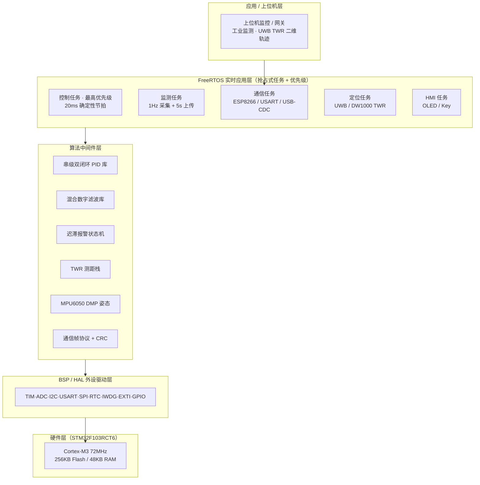
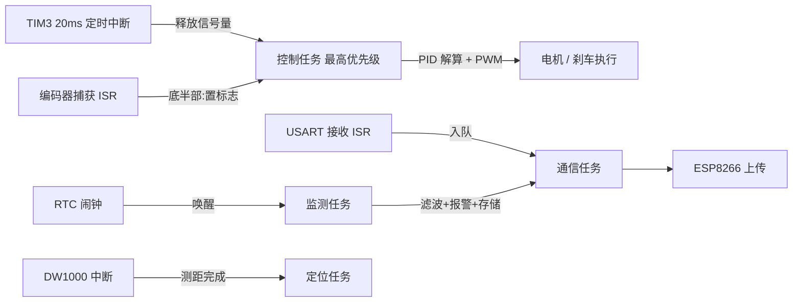
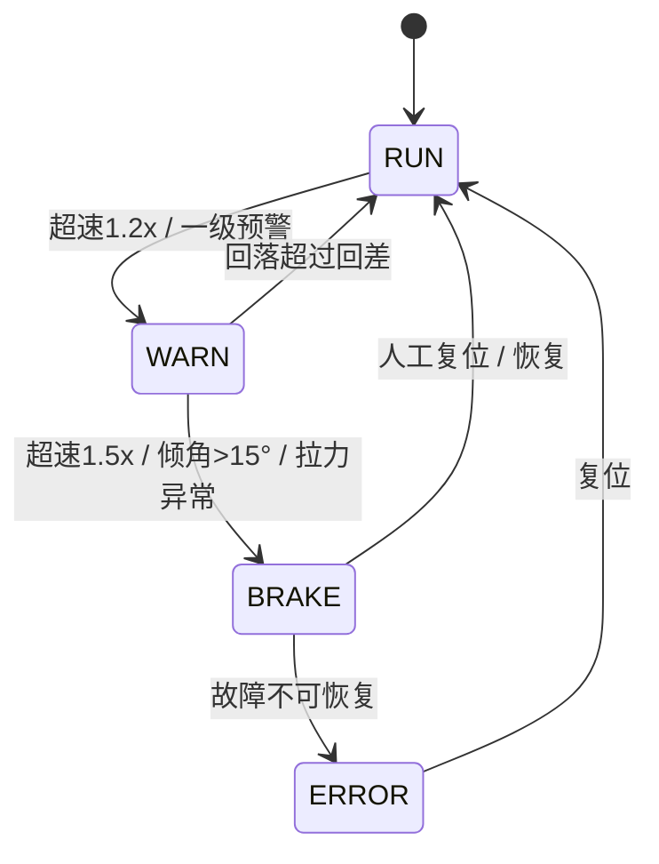

---

## 一、简介

**项目：面向地下矿井回路的边缘智能测控与定位终端开发 **

- 以 STM32F103RCT6（Cortex-M3，72MHz，256KB Flash / 48KB RAM）为主核，整合**实时控制、低功耗监测、UWB 无线定位**子系统，；采用 FreeRTOS 抢占式任务调度，划分控制 / 监测 / 通信 / 定位 / HMI （HMI ： 屏幕刷新 + 按键扫描）任务并设定优先级，保障强实时性。
- 设计多级安全状态机（RUN运行 / WARN警告 / BRAKE制动 / ERROR错误）、独立看门狗 + 任务喂狗监控、通信帧 CRC 校验与故障分级恢复等高稳定性机制；
- 低功耗监测引入混合数字滤波、迟滞报警与非阻塞 RTC 调度 + MOS 动态关断外设，显著降低平均工作电流、延长电池寿命。
- 双闭环串级 PID（姿态外环 PD + 速度内环增量 PI）实现平直段零稳态误差 / 零超调，坡道与风载扰动下 1.5~2.0s 内恢复稳定；
- UWB（DW1000）TWR 实现三基站一标签二维定位；Simulink 控制算法模型 仿真验证控制算法。
- 技术栈：Keil MDK、STM32 标准外设库、FreeRTOS、MATLAB/Simulink、C；
-  GPIO / TIM（PWM·正交编码） / ADC / I2C / USART / SPI / RTC实时时钟 / IWDG独立看门狗 等全外设驱动与算法中间件。

---

## 二、完整技术版

### 2.1 项目定位

面向工业现场对**实时控制**与**高可靠监测**的双重需求，**以 STM32F103RCT6 为核心**。平台在统一硬件与软件架构下，同时承担「运动控制」「信号采集与监测」「空间定位」三类任务，并通过上位机 / 网关实现远程监控，整体突出**实时性**与**高稳定性**设计。

### 2.2 系统总体架构

#### 2.2.1 硬件架构

- **主核**：STM32F103RCT6，72MHz，256KB Flash / 48KB RAM。
- **实时控制子系统**：增量式编码器（TIM2 正交解码）、MPU6050（I2C 倾角）、拉力传感器（HX711 / ADC）、L298N / BTN7960 电机驱动（TIM1 PWM）、电磁刹车继电器。
- **低功耗监测子系统**：扩散硅压力变送器 → RC 低通（fc=10Hz）→ TVS（SMBJ5.0A）→ 电压跟随（LM358）→ 钳位二极管（BAT54S）→ ADC；ESP8266-01S（Wi-Fi）、AT24C256（I2C EEPROM）、0.96" OLED、红黄双色 LED + 蜂鸣器、AO3401 MOS 高侧开关。
- **UWB 定位子系统**：DW1000（安信可 BU03）TWR 测距、MPU6050 DMP 姿态解算、LIS2DH12 辅助测距、USB-CDC 上位机接口。
- **电源**：12V（监测）/ 24V（控制动力）输入 → DC-DC 降压 → AMS1117-3.3V 常供；MOS 高侧开关按需关断 OLED / ESP / 传感器桥路。

#### 2.2.2 软件分层架构

| 层级 | 职责 | 主要内容 |
|---|---|---|
| 应用 / 上位机层 | 远程监控与数据呈现 | 供暖 / 工业监测网关、UWB TWR 上位机二维轨迹 |
| **FreeRTOS 实时应用层** | 抢占式任务调度 | 控制任务（最高优先级）、监测任务、通信任务、定位任务、HMI 任务 |
| 算法中间件层 | 控制 / 信号处理 / 协议 | 串级双闭环 PID 库、混合数字滤波库、迟滞报警状态机、TWR 测距栈、MPU6050 DMP 姿态、通信帧协议 + CRC |
| BSP / HAL 外设驱动层 | 寄存器 / 库函数封装 | TIM（PWM·编码器·定时节拍）、ADC、I2C、USART、SPI、RTC、IWDG、EXTI、GPIO |
| 硬件层 | MCU 与外围电路 | STM32F103RCT6 及上述传感器 / 执行器 |

#### 2.2.3 引脚 / 资源分配汇总（整合后规划）

| 功能模块 | 器件 / 外设 | STM32 引脚 | 底层配置 |
|---|---|---|---|
| 速度采集 | 增量式编码器 | PA0, PA1 | TIM2_CH1/CH2 正交编码模式（浮空输入，串联 1kΩ 限流） |
| 姿态采集 | 倾角 / MPU6050 | PA4（ADC） / PB8,PB9（I2C） | ADC1_IN4 / 软件·硬件 I2C（开漏，外部上拉） |
| 拉力采集 | 拉力传感器 | PA5 | ADC1_IN5（模拟输入） |
| 电机调速 | L298N ENA | PA8 | TIM1_CH1 PWM 复用输出 |
| 电机方向 | L298N IN1,IN2 | PB12, PB13 | GPIO 推挽输出 |
| 本地显示 | 0.96" OLED | PB8(SCL), PB9(SDA) | I2C（SSD1306） |
| 联合仿真 / 通信 | USART1 | PA9(TX), PA10(RX) | USART1 接收中断，115200 bps |
| 调试监控 | USART2 | PA2(TX), PA3(RX) | USART2，9600 bps |
| 制动执行 | 刹车继电器 | PB2 | GPIO 推挽输出（经三极管扩流 + 续流二极管） |
| 声光报警 | 心跳 LED + 蜂鸣器 | PB0, PB1 | GPIO 推挽输出 |
| 无线定位 | DW1000 | SPI 接口 | SPI1/2 + EXTI 中断 |
| 非易失存储 | AT24C256 | I2C | I2C 读写 |
| 低功耗唤醒 | RTC 闹钟 | — | RTC + 待机 / 停机模式 |

> 硬件原理图参见源目录 `SCH_Schematic2_2026-06-04.pdf`（控制 / 监测板级原理图，与上述分配一致）。

#### 2.2.4 总体架构图

### 2.3 实时性设计（重点）

- **FreeRTOS 抢占式任务调度**〔设计整合〕：将系统划分为控制、监测、通信、定位、HMI 五类任务，按实时性要求设定优先级——控制任务最高，确保控制回路始终优先占用 CPU；通信 / 定位等相对松弛任务低优先级运行，避免阻塞关键路径。
- **20ms 确定性控制节拍**：由硬件定时器（TIM3）产生 20ms 周期中断作为控制节拍（与原始 demo 一致，真实可验），在最高优先级控制任务 / ISR 中完成 PID 解算与 PWM 输出更新，保证控制周期抖动最小化。
- **中断管理与底半部**：合理配置 NVIC 中断优先级分组；编码器捕获、USART 接收等中断仅做「置标志 / 入队」的轻量底半部处理，重活交由任务上下文执行，缩小临界区、降低中断延迟。
- **时间触发 + 事件驱动混合**：控制回路采用时间触发（固定 20ms 节拍）保证确定性；监测上传、定位、HMI 采用事件 / 定时器驱动，兼顾效率与响应。

### 2.4 高稳定性设计（重点）

- **多级安全状态机**：系统运行于 `RUN / WARN / BRAKE / ERROR` 四态机。超速 1.2 倍 → 一级预警并降速；超速 1.5 倍 / 倾角超临界（15°）/ 拉力断线异常 → 二级报警并触发电磁刹车、切断驱动电源，实现分层报警与紧急制动。
- **看门狗监控**〔设计整合〕：独立看门狗（IWDG）+ 窗口看门狗（WWDG）守护；各任务定期喂狗，监管任务检测「喂狗超时 / 任务卡死」并触发系统复位或安全降级，防止固件跑飞。
- **错误处理与健康管理**〔设计整合〕：上电外设自检（传感器、EEPROM、无线模块握手）；通信帧带 CRC 校验，丢弃错包并重传；故障分级（可恢复 / 不可恢复）对应告警、降级运行或安全停机。
- **过程鲁棒性**：迟滞报警（一级 ±5%、二级 ±2% 回差）避免临界压力抖动误报；PID 非对称限幅 + Rate Limiter 抑制积分饱和与启动惯性震荡；低功耗调度在弱电场景下动态关断外设，提升供电容错。

### 2.5 核心子模块详解

#### 2.5.1 双闭环 PID 实时控制子系统

- **被控对象建模**：基于牛顿第二定律与受迫单摆模型，分别建立小车平动速度模型 `m·dv/dt = Tm·i/r − mg·sinθ − fv·v − Fwind` 与悬挂车厢姿态摆动模型 `J·α'' + c·α' + mgL·sinα = mL·cosα·v' + Mwind`，刻画平移—转动惯性耦合。
- **串级双闭环 PID**：外环为姿态闭环（位置式 PD，Kp=2、Kd=0.5，微分低通 N=20），内环为速度闭环（增量式 PI，Kp=12、Ki=0.5）；外环输出叠加至速度指令，形成「姿态修正 → 速度跟踪」的级联结构，有效抑制欠驱动耦合扰动。
- **抗积分饱和与抗震荡**：目标速度输入端串接 **Rate Limiter（斜率限制器）** 平滑加速度；姿态环输出端串接 **非对称限幅器**（上限 +0.5、下限 −1.0），允许较强减速但严格限制加速，避免内环超调。
- **HIL 硬件在环联合仿真**：通过虚拟串口（VSPE / com0com）桥接 Proteus（控制器）与 MATLAB/Simulink（被控对象），以 115200 bps 数据帧高频交换 PWM 指令与 `(v, α)` 状态量，完成跨平台闭环验证。
- **性能指标（仿真 / 联调）**：平直段匀速——零稳态误差、零速度超调；坡度突变（0.26 rad 阶跃）——速度约 1.5s 内恢复、跌落 < 目标值 15%；风载突变——摆角峰值约 0.15 rad（8.6°）、约 2.0s 内收敛至 < 0.02 rad。

#### 2.5.2 低功耗信号采集与监测子系统

- **前端抗干扰**：扩散硅压力变送器信号经 RC 低通（fc=10Hz）滤除工频干扰，TVS（SMBJ5.0A）抑制浪涌，电压跟随（LM358）隔离，BAT54S 钳位保护 ADC 引脚。
- **混合数字滤波**：去极值平均法（剔除脉冲干扰）+ 一阶滞后滤波（系数 0.2）融合，兼顾脉冲抑制与平滑。
- **迟滞报警状态机**：一级预警（偏高 / 偏低，±5% 回差）、二级危险报警（超限，±2% 回差），压力回落 / 回升超过回差后才解除，避免临界抖动误报；一级黄灯闪 + 蜂鸣间歇，二级红灯急闪 + 蜂鸣长响。
- **无线与存储**：ESP8266-01S 每 5s 打包上传至上位机；AT24C256（I2C EEPROM）本地保存 ≥100 条带时标历史记录（约 7 天）。
- **非阻塞低功耗调度**：RTC 闹钟唤醒，按「休眠 → 采集 → 发射」非阻塞模型运行；通过 AO3401 MOS 高侧开关动态切断 OLED / ESP / 传感器桥路供电，显著降低平均工作电流、延长电池寿命（Proteus + MATLAB 仿真注入高斯白噪声与脉冲干扰验证稳定）。

#### 2.5.3 UWB 无线定位子系统

- **测距与定位**：基于 DW1000（安信可 BU03）的 **TWR（双向测距）** 获取模块间距离；三基站 + 一标签构成二维定位，上位机 TWR 软件呈现二维轨迹。
- **姿态解算**：MPU6050 经 DMP（数字运动处理器）实时输出欧拉角与四元数，用于运动检测与轨迹监测；LIS2DH12 辅助测距。
- **配置与接口**：USB-CDC 与上位机通信；AT 指令将模块配置为基站 / 标签；参数存于 Flash（首次上电若无配置则提示 `Please Send`）。

#### 2.5.4 HMI 与通信外设层

- **显示 / 交互**：0.96" OLED（I2C，SSD1306）本地显示速度、倾角、压力、状态、距离；按键实现翻页 / 静音 / 手动刹车复位。
- **通信**：USART1（HIL / 调试）、USART2（终端监控）、USART3 及 USB-CDC（定位 / 上位机）多路串行通道；自主编写 `serial1/2/3` 驱动。
- **基础外设**：LED 心跳指示、TCRT5000 红外接近检测、SysTick 延时；工程含 `FreeRTOSConfig.h`，为 RTOS 化预留配置。

### 2.6 技术栈与开发工具

- **MCU / RTOS**：STM32F103RCT6（Cortex-M3）、FreeRTOS〔设计整合，已配置待启用〕。
- **固件库 / 语言**：STM32 标准外设库（StdPeriph Lib）、C 语言。
- **IDE / 仿真**：Keil MDK（生成 HEX 加载 Proteus 验证）、Proteus（电路级 + HIL 联合仿真）。
- **算法 / 建模**：MATLAB / Simulink（动力学建模、PID 整定、数字滤波与 RC 波特图、功耗模型）、car_pid.slx 系列仿真模型。
- **协议 / 接口**：I2C（OLED / EEPROM / MPU6050）、USART（调试 / HIL / 上位机）、SPI（DW1000）、ADC / TIM / RTC / IWDG。

### 2.7 系统验证与成果

| 维度 | 验证方式 | 关键结果 |
|---|---|---|
| 控制性能 | Simulink + Proteus HIL | 平直段零稳态误差、零超调；速度 6~8s 平稳到达设定值 |
| 抗扰恢复 | 坡度 / 风载阶跃 | 坡度 1.5s 内恢复（跌落 <15%）；风载摆角 ~2.0s 收敛至 <0.02 rad |
| 监测稳定性 | Proteus + MATLAB（噪声 / 脉冲注入） | 混合滤波有效抑制干扰，迟滞报警无误报 |
| 低功耗 | 功耗模型 + 实测 | 平均工作电流显著下降，电池寿命延长 |
| 定位 | UWB TWR 上位机 | 三基站二维轨迹实时呈现 |

### 2.8 延伸 / 关联技术（供暖监测物联网应用层）

源目录中的「无线供暖监测系统」课程设计（感知层—网络层—应用层三层架构，ZigBee / LoRa / NB-IoT 可选）与本项目低功耗监测子系统的「边缘节点采集 → ESP8266 / 网关 → 上位机」链路高度契合，可作为该子系统在**更广物联网场景下的应用层背景与需求参照**，体现从单点监测到系统级组网的扩展能力。

### 2.9 个人职责与项目亮点

- **独立负责**三大嵌入式子模块的设计、编码与联调，并将分散工程整合为统一固件架构。
- **技术深度**：串级 PID 抗积分饱和、混合数字滤波、迟滞报警、TWR 二维定位、HIL 联合仿真等均为自主实现。
- **工程素养**：前后台 / RTOS 双模架构认知、完整外设驱动编写、Proteus + Simulink 验证闭环。
- **可扩展性**：清晰的分层架构（BSP → 中间件 → 应用）便于新增传感器、通信方式或控制对象，契合岗位对「可持续维护固件」的要求。

---

## 三、使用说明与真实性提示

- **直接用途**：「一、简历精简版」可直接粘贴进简历；「二、完整技术版」用于面试准备与自我介绍展开。
- **〔设计整合〕标注**：FreeRTOS 抢占式调度、IWDG / WWDG 看门狗、通信帧 CRC、健康管理为在原有子模块基础上的**统一规划增强**。原始 demo 为前后台（超级循环 + 20ms 定时中断）架构，`FreeRTOSConfig.h` 已在工程中配置但未启用——面试中可据实说明「从前后台向 FreeRTOS 演进」的技术路线，避免夸大。
- **MCU 口径**：统一表述为 STM32F103RCT6 主核；原始控制 / 监测基于 C8T6、UWB 模块基于 CBT6，整合为 RCT6 属同核平滑迁移，可如实说明。
- **内容边界**：本项目仅整合嵌入式固件相关子模块，非嵌入式 / 数据分析类材料不混入，确保项目定位聚焦 STM32 固件工程师方向。
